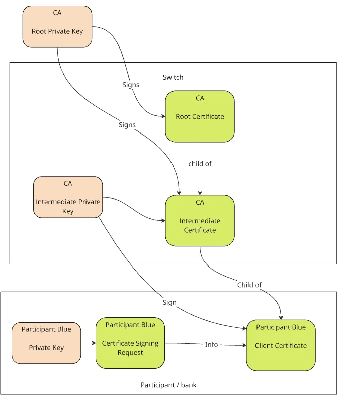
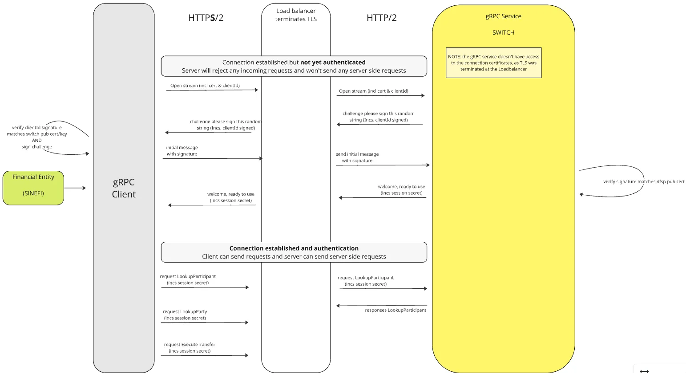

Este documento describe los mecanismos de seguridad que protegen la comunicación entre el core bancario y el Switch. Cubre la infraestructura de certificados (PKI), la configuración TLS del cliente gRPC y el protocolo de autenticación basado en reto criptográfico.

## Infraestructura de Certificados (PKI)

La identidad de cada participante se verifica mediante una cadena de certificados X.509. La Cámara actúa como Autoridad Certificadora (CA) raíz de esta infraestructura.

### Jerarquía de la CA

La cadena de confianza tiene tres niveles:

1. **CA Raíz** — certificado raíz autofirmado por la Cámara. Ancla de confianza de toda la infraestructura.
2. **CA Intermedia** — certificado intermedio firmado por la CA Raíz. Es la autoridad que emite los certificados de los participantes.
3. **Certificado del Participante** — certificado de cliente firmado por la CA Intermedia. Identifica de forma única al banco participante ante el Switch.

### Flujo de emisión del certificado

El banco participante genera su propio par de claves asimétricas y solicita un certificado a la Cámara siguiendo estos pasos:

1. El participante genera una **clave privada** (`participante.key`) en su infraestructura. Esta clave nunca debe salir de sus sistemas.
2. Con esa clave privada, el participante genera un **Certificate Signing Request (CSR)** y lo envía a la Cámara.
3. La Cámara verifica el CSR y lo firma con la **clave privada de la CA Intermedia**.
4. La Cámara devuelve al participante:
   - `participante.pem` — el certificado del participante firmado y listo para usar.
   - `hub-intermediate.pem` — el certificado público de la CA Intermedia del Switch.

### Archivos necesarios para la conexión

Con el proceso anterior completo, el participante dispone de los tres archivos que el cliente gRPC requiere:

| Archivo | Origen | Descripción |
|---|---|---|
| `participante.key` | Generado por el participante | Clave privada. Nunca se comparte. |
| `participante.pem` | Emitido por la Cámara | Certificado cliente firmado por la CA Intermedia. |
| `hub-intermediate.pem` | Provisto por la Cámara | Certificado de la CA Intermedia. Se usa como trust anchor para validar el servidor. |

### FSPID y certificado

Cada certificado de participante está vinculado a un `FspId` (identificador del participante). El `FspId` configurado en el cliente debe coincidir exactamente con el del certificado. Si no coinciden, la autenticación fallará.

> **Nota:** El campo `ClientPem` que se envía en el mensaje `InitialRequest` debe contener el **contenido en texto plano del archivo PEM** del participante — es decir, el bloque `-----BEGIN CERTIFICATE-----` ... `-----END CERTIFICATE-----`. No debe enviarse el archivo codificado en Base64 como cadena completa.

## Configuración TLS del Cliente gRPC

Los clientes gRPC provistos por la Cámara ya implementan la lógica de conexión segura. El equipo del banco solo debe **suministrar los tres archivos de certificados** al inicializar el cliente.

El cliente establece la conexión en modo seguro (TLS sobre HTTPS/2). La conexión sin TLS no está permitida.

Al configurar el cliente, asegúrate de:

- Proporcionar la ruta o el contenido de `participante.key` (clave privada del participante).
- Proporcionar la ruta o el contenido de `participante.pem` (certificado cliente).
- Proporcionar la ruta o el contenido de `hub-intermediate.pem` como trust anchor para validar el servidor.
- No activar el modo insecure bajo ninguna circunstancia.
- Que el `FspId` configurado en el cliente corresponda al `FspId` del certificado.

Consulta la documentación específica de cada cliente (Java, .NET, etc.) para ver cómo se pasan estos parámetros en cada implementación.

## Flujo de Autenticación (StartStream)

El protocolo de autenticación con el Switch ocurre dentro del método `StartStream`, que establece el stream bidireccional persistente. Este flujo es **obligatorio** y debe completarse antes de invocar cualquier otro método.

### Por qué se requiere un reto criptográfico

El Load Balancer del Switch termina TLS antes de reenviar el tráfico al servicio gRPC interno. Esto significa que el servicio gRPC no tiene acceso directo a los certificados de la conexión TLS. Para verificar la identidad del participante, el Switch utiliza un **reto criptográfico (challenge)**: le pide al cliente que firme un valor aleatorio con su clave privada, lo que prueba posesión de la clave sin transmitirla.

### Secuencia de autenticación

**Paso 1 — Abrir el stream**

El cliente abre `StartStream` y envía un mensaje inicial con los datos de identificación del participante (identificador, nombre y versión del cliente, y el certificado del participante en formato PEM). Este primer mensaje no va firmado.

**Paso 2 — Recepción del challenge**

El Switch responde con un mensaje que contiene un valor aleatorio (nonce), una firma del servidor y el fingerprint de su clave pública.

**Paso 3 — Validar la firma del servidor**

El cliente verifica que la firma del servidor sea válida y que corresponde al certificado del Switch. Si esta validación falla, el cliente cierra el stream sin enviar ninguna respuesta.

**Paso 4 — Firmar el nonce**

El cliente firma el nonce recibido con la clave privada del participante. Solo se firma el nonce; no el mensaje completo.

**Paso 5 — Enviar la respuesta al challenge**

El cliente responde con el nonce firmado en Base64.

**Paso 6 — Confirmación de autenticación**

Si la firma es válida, el Switch confirma la autenticación e incluye un secreto de sesión. A partir de este punto el stream queda autenticado y el cliente puede operar normalmente. Todas las operaciones posteriores incluyen ese secreto de sesión.

### Detalles técnicos de la firma

El cliente ya implementa el proceso de firma internamente. Los parámetros utilizados son:

| Parámetro | Valor |
|---|---|
| Algoritmo | `SHA1withRSA` |
| Encoding del nonce | `ISO-8859-1` |
| Formato de salida | Base64 estándar |

> **Importante:** el nonce se convierte a bytes usando **ISO-8859-1**, no UTF-8. Si se usara UTF-8, la firma no coincidiría y el Switch respondería con `Unauthenticated - Invalid or expired client certificate`.

## Entorno de Pruebas

Durante la fase inicial de integración, la Cámara puede encargarse de la generación, gestión y rotación de los certificados del participante. En ese caso, la Cámara entregará directamente los tres archivos necesarios (`participante.key`, `participante.pem`, `hub-intermediate.pem`) sin que el participante deba generar un CSR.

Para entornos productivos, el flujo estándar de emisión descrito en la sección anterior aplica en su totalidad.
