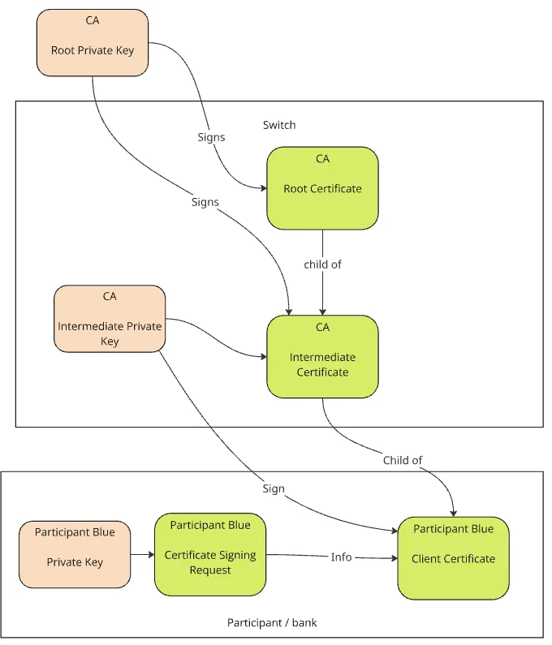
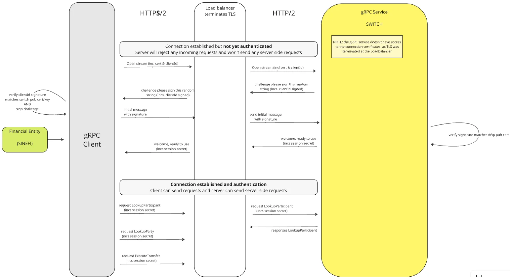

Este documento describe los mecanismos de seguridad que protegen la comunicación entre el core bancario y el Switch. Cubre la infraestructura de certificados (PKI), la configuración TLS del cliente gRPC y el protocolo de autenticación basado en reto criptográfico.

## Infraestructura de Certificados (PKI)

La identidad de cada participante se verifica mediante certificados X.509. La Cámara mantiene **dos jerarquías de CA independientes**, cada una con su propia raíz e intermedia, porque cubren propósitos distintos y no son intercambiables:

| Jerarquía | Propósito | Dónde se usa |
|---|---|---|
| **Autenticación** | Identifica al participante ante el canal gRPC | TLS del canal y firma del challenge en [`StartStream`](#flujo-de-autenticación-startstream) |
| **Firma de transacciones** | Identifica al participante como firmante de contenido de negocio | Firma de `payerSignature` / `payeeSignature` en `ExecuteTransfer` y `AcceptTransferResponse` |

### Jerarquía de cada CA

Cada una de las dos jerarquías tiene tres niveles:

1. **CA Raíz** — certificado raíz autofirmado por la Cámara. Ancla de confianza de esa jerarquía.
2. **CA Intermedia** — certificado intermedio firmado por la CA Raíz correspondiente. Es la autoridad que emite los certificados de los participantes para ese propósito.
3. **Certificado del Participante** — certificado de cliente firmado por la CA Intermedia. Identifica de forma única al banco participante ante el Switch, para ese propósito específico.

El Switch valida cada firma contra la jerarquía que le corresponde: una firma de `StartStream` se valida contra la intermedia de autenticación, y una firma de `payerSignature`/`payeeSignature` se valida contra la intermedia de transacciones. Un certificado de un propósito no es válido para el otro.

### Flujo de emisión del certificado

El banco participante genera **dos pares de claves asimétricas** — uno por jerarquía — y solicita un certificado a la Cámara por cada uno:

1. El participante genera una **clave privada de autenticación** y una **clave privada de firma de transacciones**, cada una en su infraestructura. Ninguna de las dos debe salir de sus sistemas.
2. Con cada clave privada, el participante genera un **Certificate Signing Request (CSR)** independiente y lo envía a la Cámara.
3. La Cámara verifica cada CSR y lo firma con la clave privada de la CA Intermedia correspondiente (autenticación o transacciones).
4. La Cámara devuelve al participante, por cada propósito, el certificado firmado y el certificado público de la CA Intermedia que lo emitió.

### Archivos necesarios para la conexión

Con el proceso anterior completo, el participante dispone de los archivos que el cliente gRPC requiere:

| Archivo | Origen | Descripción |
|---|---|---|
| `participant_authentication.key` | Generado por el participante | Clave privada de autenticación. Nunca se comparte. |
| `participant_authentication.pem` | Emitido por la Cámara | Certificado cliente de autenticación, firmado por la CA Intermedia de autenticación. |
| `hub-intermediate.pem` | Provisto por la Cámara | Certificado de la CA Intermedia de autenticación. |
| `participant_transaction_signing.key` | Generado por el participante | Clave privada de firma de transacciones. Nunca se comparte. |
| `hub-intermediate-transaction-signing` | Provisto por la Cámara | Certificado de la CA Intermedia de firma de transferencia. |

### FSPID y certificado

Cada certificado de participante está vinculado a un `FspId` (identificador del participante). El `FspId` configurado en el cliente debe coincidir exactamente con el del certificado. Si no coinciden, la autenticación fallará.

> **Nota:** El campo `ClientPem` que se envía en el mensaje `InitialRequest` debe contener el **contenido en texto plano del archivo PEM** del participante — es decir, el bloque `-----BEGIN CERTIFICATE-----` ... `-----END CERTIFICATE-----`. No debe enviarse el archivo codificado en Base64 como cadena completa.

## Configuración TLS del Cliente gRPC

Los clientes gRPC provistos por la Cámara ya implementan la lógica de conexión segura. El equipo del banco debe **suministrar los archivos de autenticación** al inicializar el cliente, y también los de firma de transacciones: estos últimos no participan en el handshake TLS ni en el challenge de `StartStream`, pero el cliente los necesita cargados desde el arranque para tener todo listo cuando deba firmar `payerSignature` / `payeeSignature` en una transferencia.

El cliente establece la conexión en modo seguro (HTTP/2 sobre TLS). La conexión sin TLS no está permitida.

Al configurar el cliente, asegúrate de:

- Proporcionar la ruta o el contenido de `participant_authentication.key` (clave privada de autenticación) — usada en el canal TLS y en el challenge de `StartStream`.
- Proporcionar la ruta o el contenido de `participant_authentication.pem` (certificado cliente de autenticación).
- Proporcionar la ruta o el contenido de `hub-intermediate.pem` como trust anchor para validar el servidor.
- Proporcionar la ruta o el contenido de `participant_transaction_signing.key` (clave privada de firma de transacciones) — no se usa en el stream, pero debe estar disponible para firmar transferencias.
- Proporcionar la ruta o el contenido de `hub-intermediate-transaction-signing` como trust anchor para validar las firmas de transacciones del Switch.
- No activar el modo insecure bajo ninguna circunstancia.
- Que el `FspId` configurado en el cliente corresponda al `FspId` del certificado.

Consulta la documentación específica de cada cliente (Java, .NET, etc.) para ver cómo se pasan estos parámetros en cada implementación.

## Flujo de Autenticación (StartStream)

El protocolo de autenticación con el Switch ocurre dentro del método `StartStream`, que establece el stream bidireccional persistente. Este flujo es **obligatorio** y debe completarse antes de invocar cualquier otro método.

### Por qué se requiere un reto criptográfico

El Load Balancer del Switch termina TLS antes de reenviar el tráfico al servicio gRPC interno. Esto significa que el servicio gRPC no tiene acceso directo a los certificados de la conexión TLS. Para verificar la identidad del participante, el Switch utiliza un **reto criptográfico (challenge)**: le pide al cliente que firme un valor aleatorio con su clave privada, lo que prueba posesión de la clave sin transmitirla.

### Secuencia de autenticación

**Paso 1 — Abrir el stream**

El cliente abre `StartStream` y envía un mensaje inicial con los datos de identificación del participante (identificador, nombre y versión del cliente, y el certificado del participante en formato PEM). Este primer mensaje no va firmado.

**Paso 2 — Recepción del challenge**

El Switch responde con un mensaje que contiene un valor aleatorio (nonce), una firma del servidor y el fingerprint de su clave pública.

**Paso 3 — Validar la firma del servidor**

El cliente verifica que la firma del servidor sea válida y que corresponde al certificado del Switch. Si esta validación falla, el cliente cierra el stream sin enviar ninguna respuesta.

**Paso 4 — Firmar el nonce**

El cliente firma el nonce recibido con la clave privada del participante. Solo se firma el nonce; no el mensaje completo.

**Paso 5 — Enviar la respuesta al challenge**

El cliente responde con el nonce firmado en Base64.

**Paso 6 — Confirmación de autenticación**

Si la firma es válida, el Switch confirma la autenticación e incluye un secreto de sesión. A partir de este punto el stream queda autenticado y el cliente puede operar normalmente. Todas las operaciones posteriores incluyen ese secreto de sesión.

### Detalles técnicos de la firma

El cliente ya implementa el proceso de firma internamente. Los parámetros utilizados son:

| Parámetro | Valor |
|---|---|
| Algoritmo | `SHA256withRSA` |
| Encoding del nonce | `UTF-8` |
| Formato de salida | Base64 estándar |

## Entorno de Pruebas

Durante la fase inicial de integración, la Cámara puede encargarse de la generación, gestión y rotación de los certificados del participante. En ese caso, la Cámara entregará directamente los archivos necesarios de ambas jerarquías (`participant_authentication.key`, `participant_authentication.pem`, `hub-intermediate.pem`, `participant_transaction_signing.key`, `hub-intermediate-transaction-signing`) sin que el participante deba generar ningún CSR.

Para entornos productivos, el flujo estándar de emisión descrito en la sección anterior aplica en su totalidad.
