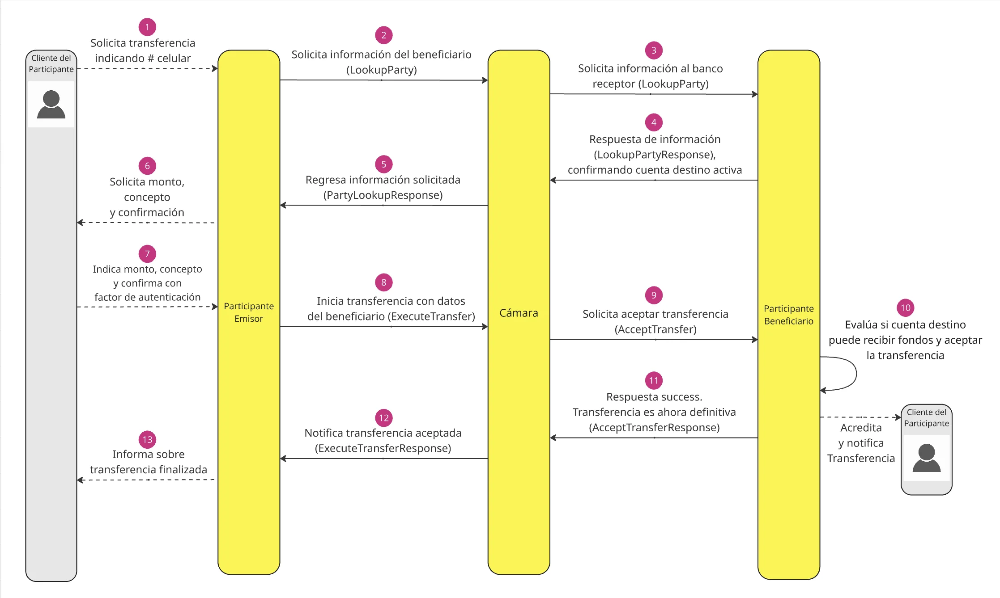

import { Tabs, TabItem, Aside } from '@astrojs/starlight/components';

`ExecuteTransfer` es el mensaje que inicia el movimiento de fondos. Se envía una vez que el usuario ha confirmado el monto, concepto y factor de autenticación. El Switch procesa la solicitud, la enruta al banco receptor y devuelve el resultado cuando la transferencia es definitiva.

Este paso requiere los datos del beneficiario obtenidos previamente con [`LookupParty`](/pch-switch-grpc-clients-doc/guides/basic-flow/lookup-party).



## Enviar la solicitud

<Tabs syncKey="lenguaje">
  <TabItem label="TypeScript">
    ```typescript
    const txnType = new TransactionType();
    txnType.setInitiator('PAYER');
    txnType.setInitiatortype('CUSTOMER');
    txnType.setScenario('TRANSFER');
    txnType.setSubscenario('DOMESTIC');

    const transferAmount = new Amount();
    transferAmount.setAmount('10');
    transferAmount.setCurrencycode('MXN');

    const payer = new Party();
    payer.setFspid('BANCOORIGEN');
    payer.setIdtype('MSISDN');
    payer.setIdvalue('1001110001');

    const payee = new Party();
    payee.setFspid('BANCODESTINO');     // id del banco beneficiario obtenido de LookupParty
    payee.setIdtype('MSISDN');
    payee.setIdvalue('10011110002');    // número de celular del beneficiario

    const transferRequest = new TransferRequest();
    transferRequest.setAmount(transferAmount);
    transferRequest.setFrom(payer);
    transferRequest.setTo(payee);
    transferRequest.setAmounttype('SEND');

    const identificadorInternoUnico = crypto.randomUUID();
    transferRequest.setHometransactionid(identificadorInternoUnico);

    transferRequest.setNote('Pago de servicios');
    transferRequest.setTransactiontype(txnType);
    transferRequest.setThreeppienabled(false);

    // Envía la solicitud al Switch
    const grpcResponse = await grpcClient.executeTransfer(transferRequest);

    // Maneja la respuesta:
    const error = grpcResponse.getError();
    if (error) {
      console.error('Error del Switch:', error.getCode(), error.getMessage());
      return; // no continuar el flujo
    }

    const success = grpcResponse.getSuccess();
    const result = {
      homeTransactionId: grpcResponse.getHometransactionid(),
      transferId:        success?.getTransferid(),
    };
    ```
  </TabItem>
  <TabItem label="Java">
    ```java
    TransactionType txnType = TransactionType.newBuilder()
        .setInitiator("PAYER")
        .setInitiatorType("CUSTOMER")
        .setScenario("TRANSFER")
        .setSubScenario("DOMESTIC")
        .build();

    Amount transferAmount = Amount.newBuilder()
        .setAmount("10")
        .setCurrencyCode("MXN")
        .build();

    Party payer = Party.newBuilder()
        .setFspId("BANCOORIGEN")
        .setIdType("MSISDN")
        .setIdValue("1001110001")
        .build();

    Party payee = Party.newBuilder()
        .setFspId("BANCODESTINO")   // banco beneficiario obtenido de LookupParty
        .setIdType("MSISDN")
        .setIdValue("10011110002")  // número de celular del beneficiario
        .build();

    String homeTransactionId = UUID.randomUUID().toString().replace("-", "");

    TransferRequest transferRequest = TransferRequest.newBuilder()
        .setAmount(transferAmount)
        .setFrom(payer)
        .setTo(payee)
        .setAmountType("SEND")
        .setHomeTransactionId(homeTransactionId)
        .setNote("Pago de servicios")
        .setTransactionType(txnType)
        .setThreeppiEnabled(false)
        .build();

    // Envía la solicitud al Switch
    TransferResponse grpcResponse = grpcClient.executeTransfer(transferRequest);

    // Maneja la respuesta
    if (grpcResponse.hasError()) {
        System.err.println("Error del Switch: "
            + grpcResponse.getError().getCode() + " "
            + grpcResponse.getError().getMessage());
        return; // no continuar el flujo
    }

    TransferSuccessResponse success = grpcResponse.getSuccess();
    String resultHomeTransactionId  = grpcResponse.getHomeTransactionId();
    String transferId               = success != null ? success.getTransferId() : "";
    ```
  </TabItem>
  <TabItem label="C#">
    ```csharp
    var transferRequest = new TransferRequest
    {
        TransactionType = new TransactionType
        {
            Initiator     = "PAYER",
            InitiatorType = "CUSTOMER",
            Scenario      = "TRANSFER",
            SubScenario   = "DOMESTIC",
        },
        Amount = new Amount
        {
            Amount_      = "10",
            CurrencyCode = "MXN",
        },
        From = new Party
        {
            FspId   = "BANCOORIGEN",
            IdType  = "MSISDN",
            IdValue = "1001110001",
        },
        To = new Party
        {
            FspId   = "BANCODESTINO",  // banco beneficiario obtenido de LookupParty
            IdType  = "MSISDN",
            IdValue = "10011110002",   // número de celular del beneficiario
        },
        AmountType        = "SEND",
        HomeTransactionId = Guid.NewGuid().ToString("N"),
        Note              = "Pago de servicios",
        ThreeppiEnabled   = false,
    };

    // Envía la solicitud al Switch
    var grpcResponse = await grpcClient.ExecuteTransfer(transferRequest);

    // Maneja la respuesta
    if (grpcResponse.Error is not null)
    {
        Console.Error.WriteLine($"Error del Switch: {grpcResponse.Error.Code} {grpcResponse.Error.Message}");
        return; // no continuar el flujo
    }

    var result = new
    {
        HomeTransactionId = grpcResponse.HomeTransactionId,
        TransferId        = grpcResponse.Success?.TransferId,
    };
    ```
  </TabItem>
  <TabItem label="PHP">
    ```php
    use Pch\Interop\Proto\Transfer\TransferRequest;
    use Pch\Interop\Proto\Transfer\Party;
    use Pch\Interop\Proto\Transfer\Amount;
    use Pch\Interop\Proto\Transfer\TransactionType;

    $response = $client->executeTransfer(
        (new TransferRequest())
            ->setHomeTransactionId(bin2hex(random_bytes(16)))
            ->setFrom((new Party())
                ->setFspId('BANCOORIGEN')
                ->setIdType('MSISDN')
                ->setIdValue('1001110001'))
            ->setTo((new Party())
                ->setFspId('BANCODESTINO')    // banco beneficiario obtenido de LookupParty
                ->setIdType('MSISDN')
                ->setIdValue('10011110002'))  // número de celular del beneficiario
            ->setAmountType('SEND')
            ->setAmount((new Amount())
                ->setCurrencyCode('MXN')
                ->setAmount('10'))
            ->setTransactionType((new TransactionType())
                ->setInitiator('PAYER')
                ->setInitiatorType('CUSTOMER')
                ->setScenario('TRANSFER')
                ->setSubScenario('DOMESTIC'))
            ->setNote('Pago de servicios')
            ->setThreeppiEnabled(false)
    );

    // Maneja la respuesta
    if ($response->hasError()) {
        echo 'Error del Switch: ' . $response->getError()->getCode() . ' ' . $response->getError()->getMessage();
        return; // no continuar el flujo
    }

    $result = [
        'homeTransactionId' => $response->getHomeTransactionId(),
        'transferId'        => $response->hasSuccess() ? $response->getSuccess()->getTransferId() : null,
    ];
    ```
  </TabItem>
</Tabs>

## Parámetros de la solicitud

**TransferRequest**

| Campo | Tipo | Requerido | Descripción |
|---|---|---|---|
| `homeTransactionId` | `string` | Sí | Identificador único interno (UUID). Nunca reutilices el mismo valor. |
| `amount` | `Amount` | Sí | Objeto con el monto y la moneda. |
| `amountType` | `string` | Sí | Tipo de monto. Usa `'SEND'` para transferencias estándar. |
| `from` | `Party` | Sí | Datos del ordenante (tu banco y cuenta). |
| `to` | `Party` | Sí | Datos del beneficiario. Usa los valores obtenidos de `LookupParty`. |
| `transactionType` | `TransactionType` | Sí | Categorización del tipo de transacción. |
| `note` | `string` | No | Concepto o descripción del pago. |
| `threeppiEnabled` | `boolean` | Sí | Indica si la transferencia usa flujo 3PPI. |

**Amount**

| Campo | Tipo | Descripción |
|---|---|---|
| `amount` | `string` | Monto como cadena (ej. `'10'`). |
| `currencyCode` | `string` | Código de moneda (ej. `'MXN'`). |

**Party**

| Campo | Tipo | Descripción |
|---|---|---|
| `fspId` | `string` | Identificador del banco de la parte. |
| `idType` | `string` | Tipo de identificador (ej. `'MSISDN'`). |
| `idValue` | `string` | Valor del identificador (ej. número de celular). |

**TransactionType**

| Campo | Tipo | Descripción |
|---|---|---|
| `initiator` | `string` | Quién inicia la transacción (ej. `'PAYER'`). |
| `initiatorType` | `string` | Tipo del iniciador (ej. `'CUSTOMER'`). |
| `scenario` | `string` | Escenario de la transacción (ej. `'TRANSFER'`). |
| `subScenario` | `string` | Sub-escenario (ej. `'DOMESTIC'`). |

Ver referencia completa: [TransferRequest](/pch-switch-grpc-clients-doc/reference/transfer-request/)

## Respuesta exitosa

Cuando el banco receptor acepta la transferencia, el Switch devuelve un `TransferResponse` con el campo `success` poblado. En este punto la transferencia es **definitiva e irrevocable**.

```json
{
  "homeTransactionId": "f3a1b2c4-e5d6-7890-abcd-ef1234567890",
  "transferId": "a7c9e2f1-3b84-4d56-91ab-cd7890ef1234"
}
```

| Campo | Fuente | Descripción |
|---|---|---|
| `homeTransactionId` | `grpcResponse` | Correlaciona con el identificador enviado en la solicitud. |
| `transferId` | `success` | Identificador único asignado por la Cámara a la transferencia. |

<Aside type="note">
  Registra el `transferId` para conciliación. Una vez recibido, la transferencia no puede revertirse a través de esta API.
</Aside>

Ver referencia completa: [TransferResponse](/pch-switch-grpc-clients-doc/reference/transfer-response/)

## Manejo de errores

Si el Switch rechaza la transferencia, `grpcResponse.getError()` devuelve un objeto con `code` y `message`. De lo contrario devuelve `undefined`.

```typescript
const error = grpcResponse.getError();
if (error) {
  console.error(`[${error.getCode()}] ${error.getMessage()}`);
}
```

{/* | Código | Descripción | Acción recomendada |
|---|---|---|
| `INSUFFICIENT_FUNDS` | Fondos insuficientes en la cuenta origen. | Informar al usuario. |
| `TRANSFER_REJECTED` | El banco receptor rechazó la transferencia. | Mostrar motivo si está disponible. |
| `TIMEOUT` | No se recibió respuesta en el tiempo límite. | Reintentar con un nuevo `requestId`. |
| `INVALID_AMOUNT` | El monto no cumple con los límites configurados. | Verificar rangos permitidos. | */}