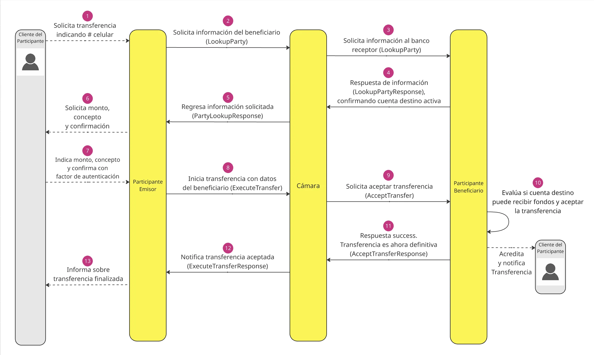

import { Tabs, TabItem, Aside } from '@astrojs/starlight/components';

`ExecuteTransfer` es una llamada gRPC que permite enviar una transferencia de dinero desde un participante A a un participante B. La transferencia se realiza de manera **definitiva e irrevocable** una vez que el banco receptor la acepta.

Este paso requiere los datos del beneficiario obtenidos previamente con [`LookupParty`](/pch-switch-grpc-clients-doc/guides/basic-flow/lookup-party).



## Firmar la transferencia

El pagador debe firmar el contenido de cada `TransferRequest` con la llave privada de **firma de transacciones** (`participant_transaction_signing.key` distinta de la llave de autenticación; ver [Seguridad](/pch-switch-grpc-clients-doc/getting-started/security) e [Inicialización del cliente](/pch-switch-grpc-clients-doc/getting-started/initialization)). El Switch reconstruye el mismo contenido canónico con los datos que recibió y compara ambas firmas si no coinciden, rechaza la transferencia con un error de firma inválida.

### Contenido canónico

El canónico se arma concatenando estos campos del propio `TransferRequest` con `|`, en este orden exacto:

| # | Campo |
|---|---|
| 1 | `homeTransactionId` |
| 2 | `from.fspId` |
| 3 | `from.idType` |
| 4 | `from.idValue` |
| 5 | `to.fspId` |
| 6 | `to.idType` |
| 7 | `to.idValue` |
| 8 | `amountType` |
| 9 | `amount.currencyCode` |
| 10 | `amount.amount` |
| 11 | `transactionType.scenario` |
| 12 | `transactionType.subScenario` |
| 13 | `transactionType.initiator` |
| 14 | `transactionType.initiatorType` |
| 15 | `threeppiEnabled` (como string `"true"`/`"false"`) |
| 16 | `creationTimestamp` |

`note`, `originalTransferFxInfo` y `extensions` no entran en el canónico.

<Aside type="caution">
  `creationTimestamp` es obligatorio — epoch en milisegundos, como string (no ISO-8601). El Switch rechaza la solicitud si falta, y también si queda fuera de la ventana de aceptación configurada del lado del Switch (pensada para descartar solicitudes viejas repetidas).
</Aside>

**Algoritmo:** RSA + SHA-256 sobre el string canónico en UTF-8, firma en Base64 el mismo algoritmo que la firma del challenge de `StartStream`, pero con la llave de firma de transacciones en vez de la de autenticación.

<Aside type="tip">
  Java, C# y PHP ya traen esta lógica integrada en el cliente (`signTransferRequest`) no necesitás armar el canónico a mano. TypeScript sí lo requiere explícitamente, como se muestra abajo.
</Aside>

A continuación se muestra un ejemplo de cómo construir la solicitud, firmarla y enviarla al Switch.
## Enviar la solicitud

<Tabs syncKey="lenguaje">
  <TabItem label="TypeScript">
    ```typescript
    const txnType = new TransactionType();
    txnType.setInitiator('PAYER');
    txnType.setInitiatortype('CUSTOMER');
    txnType.setScenario('TRANSFER');
    txnType.setSubscenario('DOMESTIC');

    const transferAmount = new Amount();
    transferAmount.setAmount('10');
    transferAmount.setCurrencycode('MXN');

    const payer = new Party();
    payer.setFspid('BANCOORIGEN');
    payer.setIdtype('MSISDN');
    payer.setIdvalue('1001110001');

    const payee = new Party();
    payee.setFspid('BANCODESTINO');     // id del banco beneficiario obtenido de LookupParty
    payee.setIdtype('MSISDN');
    payee.setIdvalue('10011110002');    // número de celular del beneficiario

    const transferRequest = new TransferRequest();
    transferRequest.setAmount(transferAmount);
    transferRequest.setFrom(payer);
    transferRequest.setTo(payee);
    transferRequest.setAmounttype('SEND');

    const identificadorInternoUnico = crypto.randomUUID();
    transferRequest.setHometransactionid(identificadorInternoUnico);

    transferRequest.setNote('Pago de servicios');
    transferRequest.setTransactiontype(txnType);
    transferRequest.setThreeppienabled(false);

    // Firma el contenido: arma el canónico y firma con la llave de firma de transacciones.
    // buildTransferRequestCanonical se importa de "@pch-private/interop-apis-bc-grpc-sync-public-lib".
    // transactionSigningHelper viene de la Inicialización del cliente.
    transferRequest.setCreationtimestamp(String(Date.now()));
    const canonical = buildTransferRequestCanonical({
      homeTransactionId: transferRequest.getHometransactionid(),
      fromFspId: payer.getFspid(),
      fromIdType: payer.getIdtype(),
      fromIdValue: payer.getIdvalue(),
      toFspId: payee.getFspid(),
      toIdType: payee.getIdtype(),
      toIdValue: payee.getIdvalue(),
      amountType: transferRequest.getAmounttype(),
      currencyCode: transferAmount.getCurrencycode(),
      amount: transferAmount.getAmount(),
      scenario: txnType.getScenario(),
      subScenario: txnType.getSubscenario(),
      initiator: txnType.getInitiator(),
      initiatorType: txnType.getInitiatortype(),
      threeppiEnabled: transferRequest.getThreeppienabled(),
      creationTimestamp: transferRequest.getCreationtimestamp(),
    });
    transferRequest.setPayersignature(await transactionSigningHelper.signString(canonical));

    // Envía la solicitud al Switch
    const grpcResponse = await grpcClient.executeTransfer(transferRequest);

    // Maneja la respuesta:
    const error = grpcResponse.getError();
    if (error) {
      console.error('Error del Switch:', error.getCode(), error.getMessage());
      return; // no continuar el flujo
    }

    const success = grpcResponse.getSuccess();
    const result = {
      homeTransactionId: grpcResponse.getHometransactionid(),
      transferId:        success?.getTransferid(),
    };
    ```
  </TabItem>
  <TabItem label="Java">
    ```java
    TransactionType txnType = TransactionType.newBuilder()
        .setInitiator("PAYER")
        .setInitiatorType("CUSTOMER")
        .setScenario("TRANSFER")
        .setSubScenario("DOMESTIC")
        .build();

    Amount transferAmount = Amount.newBuilder()
        .setAmount("10")
        .setCurrencyCode("MXN")
        .build();

    Party payer = Party.newBuilder()
        .setFspId("BANCOORIGEN")
        .setIdType("MSISDN")
        .setIdValue("1001110001")
        .build();

    Party payee = Party.newBuilder()
        .setFspId("BANCODESTINO")   // banco beneficiario obtenido de LookupParty
        .setIdType("MSISDN")
        .setIdValue("10011110002")  // número de celular del beneficiario
        .build();

    String homeTransactionId = UUID.randomUUID().toString().replace("-", "");

    TransferRequest transferRequest = TransferRequest.newBuilder()
        .setAmount(transferAmount)
        .setFrom(payer)
        .setTo(payee)
        .setAmountType("SEND")
        .setHomeTransactionId(homeTransactionId)
        .setNote("Pago de servicios")
        .setTransactionType(txnType)
        .setThreeppiEnabled(false)
        .build();

    // Firma el contenido: stampa creationTimestamp y calcula payerSignature con la
    // llave de firma de transacciones configurada al inicializar el cliente
    TransferRequest signedRequest = grpcClient.signTransferRequest(transferRequest);

    // Envía la solicitud al Switch
    TransferResponse grpcResponse = grpcClient.executeTransfer(signedRequest);

    // Maneja la respuesta
    if (grpcResponse.hasError()) {
        System.err.println("Error del Switch: "
            + grpcResponse.getError().getCode() + " "
            + grpcResponse.getError().getMessage());
        return; // no continuar el flujo
    }

    TransferSuccessResponse success = grpcResponse.getSuccess();
    String resultHomeTransactionId  = grpcResponse.getHomeTransactionId();
    String transferId               = success != null ? success.getTransferId() : "";
    ```
  </TabItem>
  <TabItem label="C#">
    ```csharp
    var transferRequest = new TransferRequest
    {
        TransactionType = new TransactionType
        {
            Initiator     = "PAYER",
            InitiatorType = "CUSTOMER",
            Scenario      = "TRANSFER",
            SubScenario   = "DOMESTIC",
        },
        Amount = new Amount
        {
            Amount_      = "10",
            CurrencyCode = "MXN",
        },
        From = new Party
        {
            FspId   = "BANCOORIGEN",
            IdType  = "MSISDN",
            IdValue = "1001110001",
        },
        To = new Party
        {
            FspId   = "BANCODESTINO",  // banco beneficiario obtenido de LookupParty
            IdType  = "MSISDN",
            IdValue = "10011110002",   // número de celular del beneficiario
        },
        AmountType        = "SEND",
        HomeTransactionId = Guid.NewGuid().ToString("N"),
        Note              = "Pago de servicios",
        ThreeppiEnabled   = false,
    };

    // Firma el contenido: stampa CreationTimestamp y calcula PayerSignature con la
    // llave de firma de transacciones configurada al inicializar el cliente
    var signedRequest = await grpcClient.SignTransferRequest(transferRequest);

    // Envía la solicitud al Switch
    var grpcResponse = await grpcClient.ExecuteTransfer(signedRequest);

    // Maneja la respuesta
    if (grpcResponse.Error is not null)
    {
        Console.Error.WriteLine($"Error del Switch: {grpcResponse.Error.Code} {grpcResponse.Error.Message}");
        return; // no continuar el flujo
    }

    var result = new
    {
        HomeTransactionId = grpcResponse.HomeTransactionId,
        TransferId        = grpcResponse.Success?.TransferId,
    };
    ```
  </TabItem>
  <TabItem label="PHP">
    ```php
    $transferRequest = (new TransferRequest())
        ->setTransactionType((new TransactionType())
            ->setInitiator('PAYER')
            ->setInitiatorType('CUSTOMER')
            ->setScenario('TRANSFER')
            ->setSubScenario('DOMESTIC'))
        ->setAmount((new Amount())
            ->setAmount('10')
            ->setCurrencyCode('MXN'))
        ->setFrom((new Party())
            ->setFspId('BANCOORIGEN')
            ->setIdType('MSISDN')
            ->setIdValue('1001110001'))
        ->setTo((new Party())
            ->setFspId('BANCODESTINO')   // banco beneficiario obtenido de LookupParty
            ->setIdType('MSISDN')
            ->setIdValue('10011110002')) // número de celular del beneficiario
        ->setAmountType('SEND')
        ->setHomeTransactionId(bin2hex(random_bytes(16)))
        ->setNote('Pago de servicios')
        ->setThreeppiEnabled(false);

    // Firma el contenido: stampa creationTimestamp y calcula payerSignature con la
    // llave de firma de transacciones configurada al inicializar el cliente
    $signedRequest = $client->signTransferRequest($transferRequest);

    // Envía la solicitud al Switch
    $grpcResponse = $client->executeTransfer($signedRequest);

    // Maneja la respuesta
    if ($grpcResponse->hasError()) {
        fwrite(STDERR, 'Error del Switch: '
            . $grpcResponse->getError()->getCode() . ' '
            . $grpcResponse->getError()->getMessage() . "\n");
        return; // no continuar el flujo
    }

    $homeTransactionId = $grpcResponse->getHomeTransactionId();
    $transferId        = $grpcResponse->hasSuccess() ? $grpcResponse->getSuccess()->getTransferId() : '';
    ```
  </TabItem>
</Tabs>

## Parámetros de la solicitud

**TransferRequest**

| Campo | Tipo | Requerido | Descripción |
|---|---|---|---|
| `homeTransactionId` | `string` | Sí | Identificador único interno (UUID). Nunca reutilices el mismo valor. |
| `amount` | `Amount` | Sí | Objeto con el monto y la moneda. |
| `amountType` | `string` | Sí | Tipo de monto. Usa `'SEND'` para transferencias estándar. |
| `from` | `Party` | Sí | Datos del ordenante (tu banco y cuenta). |
| `to` | `Party` | Sí | Datos del beneficiario. Usa los valores obtenidos de `LookupParty`. |
| `transactionType` | `TransactionType` | Sí | Categorización del tipo de transacción. |
| `payerSignature` | `string` | Sí | Firma del contenido canónico, calculada con la llave de firma de transacciones ver [Firmar la transferencia](#firmar-la-transferencia). No la setees a mano: usa el helper de firma de tu cliente. |
| `note` | `string` | No | Concepto o descripción del pago. |
| `threeppiEnabled` | `boolean` | Sí | Indica si la transferencia usa flujo 3PPI. |
| `extensions` | `ExtensionField[]` | No | Lista de pares clave/valor para datos adicionales específicos del participante. |
| `creationTimestamp` | `string` | Sí | Epoch en milisegundos, como string, al momento de firmar. Forma parte del contenido canónico ver [Firmar la transferencia](#firmar-la-transferencia). |

**Amount**

| Campo | Tipo | Descripción |
|---|---|---|
| `amount` | `string` | Monto como cadena (ej. `'10'`). |
| `currencyCode` | `string` | Código de moneda (ej. `'MXN'`). |

**Party**

| Campo | Tipo | Descripción |
|---|---|---|
| `fspId` | `string` | Identificador del banco de la parte. |
| `idType` | `string` | Tipo de identificador (ej. `'MSISDN'`). |
| `idValue` | `string` | Valor del identificador (ej. número de celular). |

**TransactionType**

| Campo | Tipo | Descripción |
|---|---|---|
| `initiator` | `string` | Quién inicia la transacción (ej. `'PAYER'`). |
| `initiatorType` | `string` | Tipo del iniciador (ej. `'CUSTOMER'`). |
| `scenario` | `string` | Escenario de la transacción (ej. `'TRANSFER'`). |
| `subScenario` | `string` | Sub-escenario (ej. `'DOMESTIC'`). |

**ExtensionField**

| Campo | Tipo | Descripción |
|---|---|---|
| `key` | `string` | Clave del campo de extensión. |
| `value` | `string` | Valor del campo de extensión. |

Ver referencia completa: [TransferRequest](/pch-switch-grpc-clients-doc/reference/transfer-request/)

## Respuesta exitosa

Cuando el banco receptor acepta la transferencia, el Switch devuelve un `TransferResponse` con el campo `success` poblado. En este punto la transferencia es **definitiva e irrevocable**.

```json
{
  "homeTransactionId": "f3a1b2c4-e5d6-7890-abcd-ef1234567890",
  "transferId": "a7c9e2f1-3b84-4d56-91ab-cd7890ef1234"
}
```

| Campo | Fuente | Descripción |
|---|---|---|
| `homeTransactionId` | `grpcResponse` | Correlaciona con el identificador enviado en la solicitud. |
| `transferId` | `success` | Identificador único asignado por la Cámara a la transferencia. |
| `switchResponseSignature` | `grpcResponse` | Firma del Switch sobre el resultado ver [Verificar la firma del switch](#verificar-la-firma-del-switch). |
| `payerSignature` | `success` | Copia de la firma que el pagador envió en la solicitud. |
| `switchRequestSignature` | `success` | Firma del Switch sobre la solicitud original del pagador (canónico de la solicitud + `payerSignature`). Confirma que el Switch procesó la solicitud sin alterarla. |
| `payeeSignature` | `success` | Firma que el banco receptor puso sobre su aceptación de la transferencia. |

<Aside type="note">
  Registra el `transferId` para conciliación. Una vez recibido, la transferencia no puede revertirse a través de esta API.
</Aside>

<Aside type="tip">
  `payerSignature`, `switchRequestSignature` y `payeeSignature` en `success` forman la cadena completa de firmas útil para auditoría, no necesarias para el flujo básico.
</Aside>

Ver referencia completa: [TransferResponse](/pch-switch-grpc-clients-doc/reference/transfer-response/)

## Verificar la firma del switch

`TransferResponse` trae `switchResponseSignature` la firma del Switch sobre el resultado (`transferId`, `homeTransactionId`, `errorCode`, `errorReason`, unidos con `|`). Verificarla confirma que la respuesta no fue alterada en tránsito. Es opcional pero recomendado, sobre todo para conciliación.

<Tabs syncKey="lenguaje">
  <TabItem label="TypeScript">
    ```typescript
    const responseCanonical = buildTransferResponseCanonical({
      transferId: success?.getTransferid() ?? '',
      homeTransactionId: grpcResponse.getHometransactionid(),
      errorCode: error?.getCode() ?? '',
      errorReason: error?.getMessage() ?? '',
    });
    const validSwitchSignature = await transactionSigningHelper.validateSignatureAgainstCA(
      responseCanonical,
      grpcResponse.getSwitchresponsesignature()
    );
    ```
  </TabItem>
  <TabItem label="Java">
    ```java
    boolean validSwitchSignature = grpcClient.verifyTransferResponseSignature(grpcResponse);
    ```
  </TabItem>
  <TabItem label="C#">
    ```csharp
    var validSwitchSignature = await grpcClient.VerifyTransferResponseSignature(grpcResponse);
    ```
  </TabItem>
  <TabItem label="PHP">
    ```php
    $validSwitchSignature = $client->verifyTransferResponseSignature($grpcResponse);
    ```
  </TabItem>
</Tabs>

<Aside type="note">
  Si la respuesta ya trae un resultado exitoso, no conviertas un `false` acá en un fallo sintético del negocio: la transferencia ya se liquidó de un lado o del otro. Un `false` solo significa que el resultado no se pudo confirmar criptográficamente. Por el momento este no es un proceso de conciliación implementado por la Cámara próximamente estará disponible.
</Aside>

## Manejo de errores

Si el Switch rechaza la transferencia, `grpcResponse.getError()` devuelve un objeto con `code` y `message`. De lo contrario devuelve `undefined`.

```typescript
const error = grpcResponse.getError();
if (error) {
  console.error(`[${error.getCode()}] ${error.getMessage()}`);
}
```

{/* | Código | Descripción | Acción recomendada |
|---|---|---|
| `INSUFFICIENT_FUNDS` | Fondos insuficientes en la cuenta origen. | Informar al usuario. |
| `TRANSFER_REJECTED` | El banco receptor rechazó la transferencia. | Mostrar motivo si está disponible. |
| `TIMEOUT` | No se recibió respuesta en el tiempo límite. | Reintentar con un nuevo `requestId`. |
| `INVALID_AMOUNT` | El monto no cumple con los límites configurados. | Verificar rangos permitidos. | */}