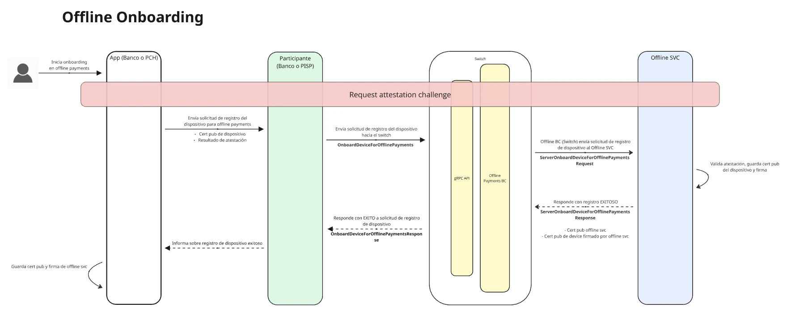

import { Aside } from '@astrojs/starlight/components';

Los **pagos offline** permiten que un Usuario pague a otro desde una app móvil **sin conexión a internet**, usando Bluetooth entre ambos dispositivos. Para lograrlo, el Usuario reserva previamente una parte de su saldo y recibe en su dispositivo un conjunto de **tokens**. Cuando cualquiera de los dos dispositivos recupera la conexión, el pago se presenta al Switch y se convierte en una transferencia entre las cuentas del pagador y del beneficiario.

## Tokens

Un token es un respaldo, de una reserva de fondos que el Participante ya autorizó.

El token **no es dinero** y por sí solo no se puede cobrar. Sirve para que el pagador le entregue al beneficiario una prueba verificable del pago mientras ninguno de los dos tiene conexión. El dinero se mueve después, cuando el Participante recibe ese pago y lo liquida.

La contabilidad siempre la lleva el Participante. El Switch únicamente registra el estado de cada token, para impedir que el mismo token se gaste o se liquide dos veces.

- Cada token tiene una denominación fija: **1 token equivale a 1 peso**. La única moneda soportada es `MXN`.
- El Switch firma cada token de forma individual.
- La app guarda los tokens cifrados en el almacenamiento seguro del dispositivo.
- Cada token tiene una fecha de expiración, definida al generarlo.

<Aside type="caution" title="Importante">
  Los tokens sirven para **un solo uso**. El beneficiario que recibe un pago offline no obtiene tokens gastables: obtiene un derecho pendiente de liquidación, y no puede usar lo recibido para una nueva transferencia offline antes de liquidarlo en línea.
</Aside>

## Certificado de pago offline

Cada pago entre dispositivos produce un **certificado de pago offline**: el comprobante de la operación, que más tarde se presenta al Switch para liquidar el pago. Se arma en tres partes, firmadas en cadena por ambos dispositivos:

- **Propuesta de pago**: la construye el dispositivo del pagador con los tokens que va a entregar. Incluye el identificador de la transacción, el monto, la moneda, el concepto, los datos del pagador y del beneficiario, y las fechas de creación y expiración.
- **Aceptación del beneficiario**: el dispositivo del beneficiario verifica los tokens recibidos y firma la propuesta.
- **Autorización del pagador**: el dispositivo del pagador verifica la firma del beneficiario y, a su vez, firma esa aceptación.

Como el certificado queda firmado por ambas partes, ninguna puede desconocer después la operación. Los dos dispositivos conservan una copia y cualquiera de los dos puede presentarla para liquidar el pago cuando recupere la conexión.

## Comunicación entre dispositivos

El pago offline ocurre sobre un canal **Bluetooth Low Energy (BLE)** entre el dispositivo del pagador y el del beneficiario:

- Los dispositivos se emparejan con el mecanismo nativo del sistema operativo, en su modalidad **autenticada, con protección contra intermediarios (MITM)**: el sistema muestra su propio diálogo de emparejamiento con confirmación numérica, que ambos usuarios aceptan. Según las capacidades de cada dispositivo, esa confirmación es por comparación numérica o por passkey.
- Todas las características del servicio BLE exigen escritura cifrada y autenticada, así que no hay intercambio de datos hasta que el emparejamiento se completa. En Android, la app espera a que el vínculo quede establecido antes de continuar.
- Sobre ese canal, la app además cifra el contenido con **AES-GCM de 256 bits**, usando las llaves que recibió durante el onboarding del Usuario.
- Al inicio del proceso, ambos dispositivos intercambian sus certificados públicos. Con ellos, cada dispositivo valida dos cosas sin necesidad de conexión:
  - Que el otro dispositivo fue registrado para pagos offline.
  - Que los tokens que está recibiendo los está usando el dispositivo para el que fueron emitidos.

## Seguridad

### Llaves y certificados

- Cada dispositivo genera un par de llaves de uso exclusivo para pagos offline. Las llaves se almacenan en el **Secure Enclave** en iOS o en el **Android Keystore**.
- El algoritmo de firma es **ed25519**, elegido principalmente para reducir el tamaño de las firmas durante la transferencia offline.
- Al registrar un dispositivo, el Switch firma el hash de su llave pública. Ese hash funciona como identificador del dispositivo.
- El dispositivo y el Switch intercambian certificados públicos, para poder validar identidades sin conexión y durante la liquidación del pago.

### Durante la transferencia

Cada pago offline produce un **certificado de pago**, firmado tanto por el dispositivo pagador como por el del beneficiario. La doble firma asegura el no repudio de la operación. Ambos dispositivos conservan una copia del certificado, ya que cualquiera de los dos puede presentarlo después para liquidar el pago.

### Durante la liquidación

- La comunicación en línea usa **gRPC autenticado con certificados y TLS**.
- Antes de solicitar la liquidación al Participante, el Switch valida el certificado del pago, las firmas del pagador y del beneficiario, la firma y el estado de cada token.
- La primera presentación válida de un pago es la única que genera el cargo. Las presentaciones posteriores devuelven el mismo resultado y no generan un segundo débito.

### Atestación

La **atestación** es la comprobación, hecha por los servicios de integridad de Google Play y de App Store, de que la app que opera pagos offline es la app oficial y de que el dispositivo donde corre es íntegro. El Switch entrega un challenge, la app genera con él la atestación en su plataforma, y el resultado viaja en las operaciones de pagos offline que lo requieren: el registro del dispositivo, la generación de tokens y la presentación de certificados.

Para pasar la atestación, el dispositivo del Usuario debe cumplir:

- **Android**: dispositivo no rooteado y con las llaves del dispositivo respaldadas por hardware, al menos en el entorno de ejecución confiable del procesador (*Trusted Execution Environment*). No basta con llaves protegidas únicamente por software.
- **iOS**: dispositivo sin jailbreak, con iOS 15 o superior.
- En ambos casos, la app debe haberse descargado de la tienda de aplicaciones oficial de cada sistema operativo.

## Casos de uso

El Participante **responde a las solicitudes que le envía el Switch**, registrando los handlers correspondientes en el cliente gRPC:

- **[Reservar fondos para uso offline](/pch-switch-grpc-clients-doc/guides/offline-payments/offline-funds-reservation-handler/)**: el Usuario indica desde la app el monto que quiere tener disponible para pagos offline, y el Participante autoriza la reserva contra su cuenta.
- **[Liquidar un pago offline](/pch-switch-grpc-clients-doc/guides/offline-payments/settle-offline-transfers-handler/)**: una vez validado el pago, el Participante del pagador lo acredita contra la reserva y ejecuta la transferencia hacia el beneficiario.
- **[Liberar la reserva](/pch-switch-grpc-clients-doc/guides/offline-payments/release-offline-funds-reservation-handler/)**: el Usuario pide que los fondos reservados que no usó vuelvan a estar disponibles en su cuenta.

<Aside type="note">
  Estos son los **únicos métodos** que el Participante debe implementar cuando sus Usuarios operan con la app PISP de la Cámara, que se encarga del registro del dispositivo, de la atestación, del pago por Bluetooth y de presentar los pagos para su liquidación.

  Si el Participante quiere ofrecer pagos offline desde la app de su propio banco, además debe invocar los métodos que la app PISP invoca en su lugar y resolver en su app la parte del dispositivo. Todo eso se documenta en [Integración con app propia](/pch-switch-grpc-clients-doc/guides/offline-payments/own-app/app-specifications/).
</Aside>
