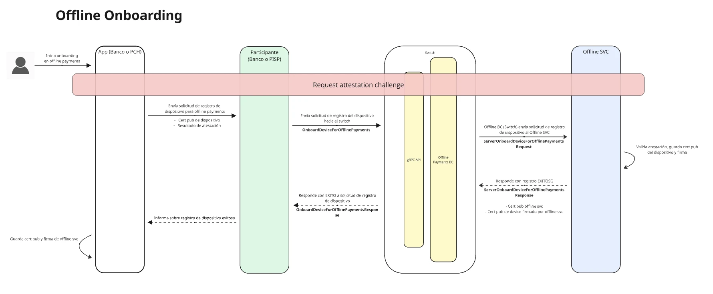

import { Aside } from '@astrojs/starlight/components';

Los **pagos offline** permiten que un Usuario pague a otro desde una app móvil **sin conexión a internet**, a través de Bluetooth entre ambos dispositivos. Para lograrlo, el Usuario reserva previamente una parte de su saldo y recibe en su dispositivo un conjunto de **tokens**. Cuando cualquiera de los dos dispositivos recupera la conexión, el pago se presenta al Switch y se convierte en una transferencia entre las cuentas del pagador y del beneficiario.

## Tokens

Un token es un respaldo de una reserva de fondos que el Participante ya autorizó.

El token **no es dinero** y por sí solo no se puede cobrar. Sirve para que el pagador le entregue al beneficiario una prueba verificable del pago mientras ninguno de los dos tiene conexión. El dinero se mueve después, cuando el Participante recibe ese pago y lo liquida.

La contabilidad siempre la lleva el Participante. El Switch únicamente registra el estado de cada token, para impedir que el mismo token se gaste o se liquide dos veces.

- Todos los tokens tienen la misma denominación: **1 token equivale a 1 peso**, y la única moneda soportada es `MXN`.
- El Switch firma cada token por separado y le fija una fecha de expiración al generarlo.
- La app los guarda cifrados en el almacenamiento seguro del dispositivo.

<Aside type="caution" title="Importante">
  Los tokens sirven para **un solo uso**. Quien recibe un pago offline no obtiene tokens que pueda volver a gastar, sino un derecho pendiente de liquidación: no puede usar ese dinero en otra transferencia offline hasta liquidarlo en línea.
</Aside>

## Certificado de pago offline

Cada pago entre dispositivos produce un **certificado de pago offline**: el comprobante de la operación, que más tarde se presenta al Switch para liquidarla.

El pagador propone el pago con los tokens que va a entregar, el beneficiario acepta firmando la propuesta y el pagador firma esa aceptación. Al quedar firmado por ambas partes, ninguna puede desconocer después la operación. Ambos dispositivos conservan una copia y cualquiera de los dos puede presentarla.

## Comunicación entre dispositivos

El pago offline ocurre sobre un canal **Bluetooth Low Energy (BLE)** entre el dispositivo del pagador y el del beneficiario:

- El emparejamiento es el nativo del sistema operativo, en su modalidad **autenticada, con protección contra intermediarios (MITM)**: pide a ambos Usuarios una confirmación numérica. Hasta que se completa, no se intercambia ningún dato.
- La información que viaja por ese canal va cifrada con **AES-GCM de 256 bits**.
- Al inicio, ambos dispositivos intercambian sus certificados públicos, con los que validan sin conexión dos cosas: que el otro dispositivo está registrado para pagos offline, y que quien entrega los tokens es el dispositivo para el que se emitieron.

## Seguridad

### Llaves y certificados

- Cada dispositivo genera un par de llaves de uso exclusivo para pagos offline y lo guarda en el **Secure Enclave** en iOS o en el **Android Keystore**.
- Las firmas usan **ed25519**, elegido para que ocupen menos espacio durante la transferencia offline.
- Al registrar el dispositivo, el Switch firma el hash de su llave pública, que funciona como su identificador.
- Dispositivo y Switch intercambian certificados públicos, para validar identidades sin conexión y durante la liquidación del pago.

### Atestación

La **atestación** comprueba que la app que opera pagos offline es la app oficial y que el dispositivo donde corre es íntegro. La realizan los servicios de integridad de Google Play y de App Store.

El Switch entrega un challenge, la app genera con él la atestación en su plataforma, y el resultado acompaña a las operaciones que lo requieren: el registro del dispositivo, la generación de tokens y la presentación de certificados.

Para pasar la atestación, el dispositivo del Usuario debe cumplir:

- **Android**: no rooteado, y con las llaves respaldadas por hardware, al menos en el entorno de ejecución confiable del procesador (*Trusted Execution Environment*). No basta con protegerlas por software.
- **iOS**: sin jailbreak y con iOS 15 o superior.
- En ambos casos, la app debe haberse descargado de la tienda de aplicaciones oficial del sistema operativo.

## Casos de uso

### Registro del dispositivo

Antes de cualquier otra operación, el dispositivo del Usuario debe registrarse para pagos offline: genera su par de llaves, comprueba su integridad mediante la [atestación](#atestación) y queda identificado ante el Switch por el hash de su llave pública.

Cuando los Usuarios operan con la app PISP, el Participante no implementa nada en este flujo. Con app propia, el registro se hace con [Registrar un dispositivo](/pch-switch-grpc-clients-doc/guides/offline-payments/own-app/onboard-device-for-offline-payments/).

### Flujos que atiende el Participante

El Participante **responde a las solicitudes que le envía el Switch**, registrando los handlers correspondientes en el cliente gRPC:

- **[Reservar fondos para uso offline](/pch-switch-grpc-clients-doc/guides/offline-payments/offline-funds-reservation-handler/)**: el Usuario indica desde la app el monto que quiere tener disponible para pagos offline, y el Participante autoriza la reserva contra su cuenta.
- **[Liquidar un pago offline](/pch-switch-grpc-clients-doc/guides/offline-payments/settle-offline-transfers-handler/)**: una vez validado el pago, el Participante del pagador lo liquida contra la reserva y ejecuta la transferencia hacia el beneficiario.
- **[Liberar la reserva](/pch-switch-grpc-clients-doc/guides/offline-payments/release-offline-funds-reservation-handler/)**: el Usuario indica desde la app el monto que quiere liberar, y el Participante lo devuelve a su saldo disponible.

<Aside type="note">
  Cuando los Usuarios operan con la app PISP de la Cámara, estos tres son los **únicos métodos** que el Participante debe implementar: la app se encarga del registro del dispositivo, de la atestación, del pago por Bluetooth y de presentar los pagos para su liquidación.

  Para ofrecer pagos offline desde su propia app, el Participante además debe invocar los métodos que la app PISP invoca en su lugar y resolver en su app la parte del dispositivo. Eso se documenta en [Integración con app propia](/pch-switch-grpc-clients-doc/guides/offline-payments/own-app/app-specifications/).
</Aside>
