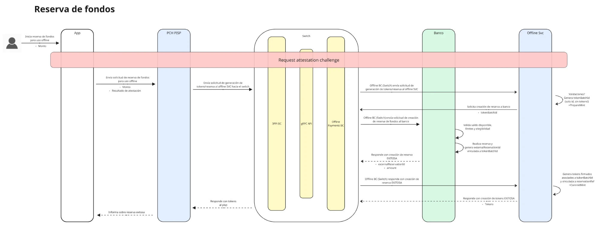

import { Tabs, TabItem, Aside } from '@astrojs/starlight/components';

`CreateTokensFromOfflineFunds` solicita los tokens que el Usuario usará para pagar sin conexión. Esta llamada es la que dispara todo el proceso: el Switch le pide al Participante la [reserva de fondos](/pch-switch-grpc-clients-doc/guides/offline-payments/offline-funds-reservation-handler/) y, una vez constituida, devuelve los tokens ya firmados.



<Aside type="note">
  El mismo Participante recibe, durante esta llamada, la solicitud de reserva en su handler de `CreateOfflineFundsReservations`. Los tokens solo se generan si esa reserva se constituye.
</Aside>

## Enviar la solicitud

<Tabs syncKey="lenguaje">
  <TabItem label="TypeScript">
    ```typescript
    const attestationInfo = new AttestationInfo();
    attestationInfo.setChallengeid(challengeId);
    attestationInfo.setPackagename('mx.mibanco.app');
    attestationInfo.setToken(attestationToken);

    const request = new CreateTokensFromOfflineFundsRequest();
    request.setSourcefspid('MIBANCO');
    request.setPublickeyhash(devicePublicKeyHash);
    request.setPartyid('10011110002');
    request.setAmount('500');
    request.setCurrencycode('MXN');
    request.setAccountid('CUENTA-001');
    request.setAttestationinfo(attestationInfo);

    // Envía la solicitud al Switch
    const grpcResponse = await grpcClient.createTokensFromOfflineFunds(request);

    // Maneja la respuesta
    const failure = grpcResponse.getFailureresponse();
    if (failure) {
      console.error('No se generaron los tokens:', failure.getFailurereason());
      return;       // no continuar el flujo
    }

    const tokens = grpcResponse.getSuccessresponse().getTokensList().map(token => ({
      payload:         token.getPayload(),
      minterSignature: token.getMintersignature(),
    }));

    // Entrega los tokens a la app para que los guarde en su almacenamiento seguro
    ```
  </TabItem>
  <TabItem label="Java">
    ```java
    AttestationInfo attestationInfo = AttestationInfo.newBuilder()
        .setChallengeId(challengeId)
        .setPackageName("mx.mibanco.app")
        .setToken(attestationToken)
        .build();

    CreateTokensFromOfflineFundsRequest request = CreateTokensFromOfflineFundsRequest.newBuilder()
        .setSourceFspId("MIBANCO")
        .setPublicKeyHash(devicePublicKeyHash)
        .setPartyId("10011110002")
        .setAmount("500")
        .setCurrencyCode("MXN")
        .setAccountId("CUENTA-001")
        .setAttestationInfo(attestationInfo)
        .build();

    // Envía la solicitud al Switch
    CreateTokensFromOfflineFundsResponse grpcResponse = grpcClient.createTokensFromOfflineFunds(request);

    // Maneja la respuesta
    if (grpcResponse.hasFailureResponse()) {
        System.err.println("No se generaron los tokens: "
            + grpcResponse.getFailureResponse().getFailureReason());
        return; // no continuar el flujo
    }

    List<Token> tokens = grpcResponse.getSuccessResponse().getTokensList();
    ```
  </TabItem>
  <TabItem label="C#">
    ```csharp
    var request = new CreateTokensFromOfflineFundsRequest
    {
        SourceFspId   = "MIBANCO",
        PublicKeyHash = devicePublicKeyHash,
        PartyId       = "10011110002",
        Amount        = "500",
        CurrencyCode  = "MXN",
        AccountId     = "CUENTA-001",
        AttestationInfo = new AttestationInfo
        {
            ChallengeId = challengeId,
            PackageName = "mx.mibanco.app",
            Token       = attestationToken,
        },
    };

    // Envía la solicitud al Switch
    var grpcResponse = await grpcClient.CreateTokensFromOfflineFunds(request);

    // Maneja la respuesta
    if (grpcResponse.FailureResponse is not null)
    {
        Console.Error.WriteLine($"No se generaron los tokens: {grpcResponse.FailureResponse.FailureReason}");
        return; // no continuar el flujo
    }

    var tokens = grpcResponse.SuccessResponse.Tokens;
    ```
  </TabItem>
  <TabItem label="PHP">
    ```php
    $attestationInfo = (new AttestationInfo())
        ->setChallengeId($challengeId)
        ->setPackageName('mx.mibanco.app')
        ->setToken($attestationToken);

    $request = (new CreateTokensFromOfflineFundsRequest())
        ->setSourceFspId('MIBANCO')
        ->setPublicKeyHash($devicePublicKeyHash)
        ->setPartyId('10011110002')
        ->setAmount('500')
        ->setCurrencyCode('MXN')
        ->setAccountId('CUENTA-001')
        ->setAttestationInfo($attestationInfo);

    // Envía la solicitud al Switch
    $grpcResponse = $client->createTokensFromOfflineFunds($request);

    // Maneja la respuesta
    if ($grpcResponse->hasFailureResponse()) {
        fwrite(STDERR, 'No se generaron los tokens: '
            . $grpcResponse->getFailureResponse()->getFailureReason() . "\n");
        return; // no continuar el flujo
    }

    $tokens = $grpcResponse->getSuccessResponse()->getTokens();
    ```
  </TabItem>
</Tabs>

## Parámetros de la solicitud

| Campo | Tipo | Requerido | Descripción |
|---|---|---|---|
| `sourceFspId` | `string` | Sí | FSP que origina la solicitud (el Participante). |
| `publicKeyHash` | `string` | Sí | Hash de la llave pública del dispositivo, obtenido al registrarlo. |
| `partyId` | `string` | Sí | Identificador del Usuario (ej. número de celular). |
| `amount` | `string` | Sí | Monto total a reservar y a convertir en tokens. |
| `currencyCode` | `string` | Sí | Moneda de la reserva (ej. `'MXN'`). |
| `accountId` | `string` | Sí | Cuenta del Usuario sobre la que se constituye la reserva. |
| `attestationInfo` | `AttestationInfo` | Sí | Resultado de la atestación del dispositivo: `challengeId`, `packageName` y `token`. |

## Respuesta

La respuesta trae `successResponse` o `failureResponse`, nunca ambos.

| Campo | Tipo | Descripción |
|---|---|---|
| `sourceFspId` | `string` | FSP que origina la respuesta. |
| `destinationFspId` | `string` | FSP destino de la respuesta (el Participante). |
| `successResponse.tokens` | `Token[]` | Tokens generados. Cada uno trae su `payload` y la firma `minterSignature`. |
| `failureResponse.failureReason` | `string` | Motivo por el que no se generaron los tokens. |
| `failureResponse.error` | `ErrorResponse` | Detalle del error, si viene. |

### Token

| Campo | Tipo | Descripción |
|---|---|---|
| `payload.tokenId` | `string` | Identificador del token. |
| `payload.amount` | `string` | Valor del token. |
| `payload.currency` | `string` | Moneda del token. |
| `payload.expiresAt` | `number` | Fecha de expiración del token. |
| `payload.payerPublicKeyHash` | `string` | Hash de la llave pública del dispositivo dueño del token. |
| `payload.minterPublicKeyHash` | `string` | Hash de la llave pública con la que se firmó. |
| `minterSignature` | `string` | Firma del token. |

<Aside type="caution">
  Los tokens deben guardarse cifrados en el almacenamiento seguro del dispositivo y nunca salir de ahí, salvo durante un pago offline.
</Aside>
