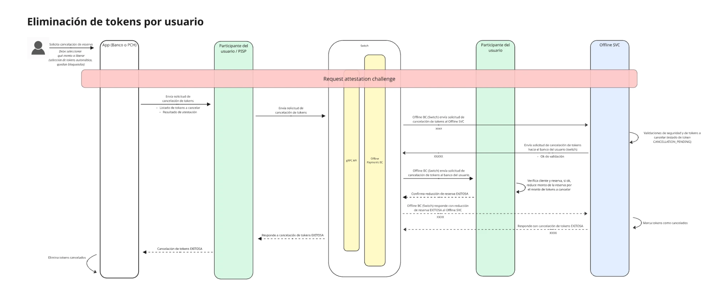

import { Aside } from '@astrojs/starlight/components';

Este método permitirá que un Usuario libere desde la app todo o parte de su saldo reservado para pagos offline, para que vuelva a quedar disponible en su cuenta.

<Aside type="caution">
  Este método aún no está disponible en el Switch ni en los clientes gRPC. Esta página se actualizará cuando se publique.
</Aside>
