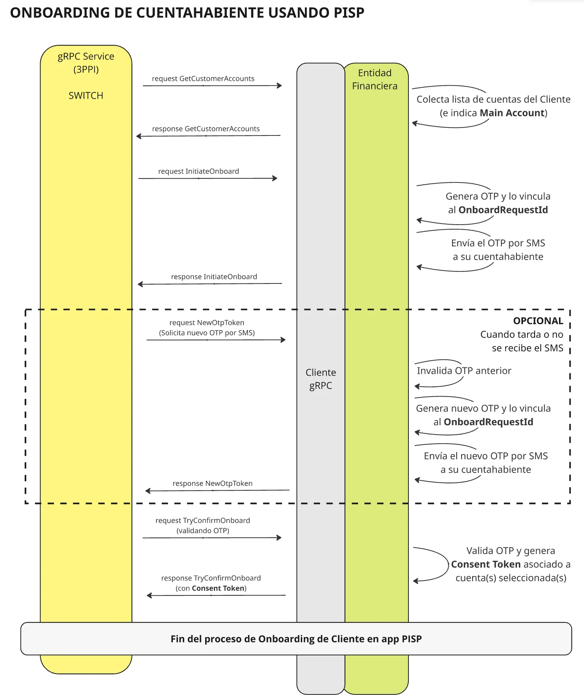
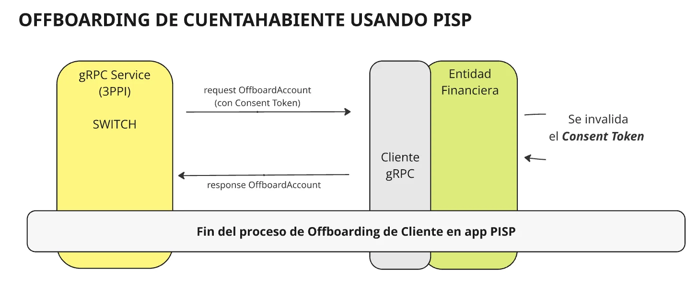

import { Aside } from '@astrojs/starlight/components';

Esta página describe la secuencia completa de pasos que ocurren cuando un Cliente se da de alta o de baja en una app PISP. Para cada paso encontrarás el enlace a la documentación del método correspondiente, donde se detallan los campos y el código de implementación.

---

## Onboarding

El onboarding es el proceso mediante el cual un Cliente vincula sus cuentas bancarias a una app PISP. El objetivo es establecer un **Consent Token** que autorice a la app a operar sobre esas cuentas en el futuro.

El flujo involucra cuatro pasos en secuencia, con un paso opcional en caso de problemas con el envío del SMS:

### Paso 1 — Consulta de cuentas

El módulo 3ppi solicita al banco la lista de cuentas disponibles del Cliente. El banco debe responder con todas las cuentas que el Cliente puede vincular, indicando cuál es la cuenta principal.

→ Ver implementación: [Responder consulta de cuentas del cliente](/guides/pisp-flow/get-customer-accounts-handler/)

### Paso 2 — Inicio del onboarding

Con las cuentas seleccionadas por el Cliente en la app PISP, el módulo 3ppi notifica al banco para que formalice el inicio del proceso. En este paso el banco debe:

1. Registrar el onboarding en curso asociado al `onboardRequestId`.
2. Generar un OTP y vincularlo al `onboardRequestId`.
3. Enviar el OTP por SMS al número del Cliente.

→ Ver implementación: [Iniciar onboarding de cliente](/guides/pisp-flow/onboarding/initiate-onboard-handler/)

### Paso 3 — Reenvío de OTP _(opcional)_

Si el Cliente no recibe el SMS con el OTP, la app PISP puede solicitar uno nuevo. Este paso puede repetirse las veces que sea necesario antes de que el onboarding expire. El banco debe invalidar el OTP anterior y generar uno nuevo.

→ Ver implementación: [Generar nuevo OTP](/guides/pisp-flow/onboarding/new-otp-token-handler/)

### Paso 4 — Confirmación del onboarding

El Cliente ingresa el OTP en la app PISP. El módulo 3ppi lo envía al banco para su validación. Si el OTP es correcto y no ha expirado, el banco debe:

1. Invalidar el OTP.
2. Generar el **Consent Token** (se recomienda UUID v4).
3. Almacenar la relación entre el Consent Token, las cuentas seleccionadas y los tipos de acceso autorizados.

El Consent Token que se devuelve en este paso es el que acompañará todas las operaciones PISP futuras del Cliente.

→ Ver implementación: [Confirmar onboarding de cliente](/guides/pisp-flow/onboarding/try-confirm-onboard-handler/)

<Aside type="note">
  Al finalizar el paso 4, el proceso de onboarding está completo. El módulo pisp conserva el Consent Token y lo incluirá en todos los requests posteriores que realice a nombre del Cliente.
</Aside>

---

## Offboarding

El offboarding ocurre cuando un Cliente decide desvincular sus cuentas de la app PISP. El módulo 3ppi envía al banco el Consent Token a invalidar. Una vez invalidado, cualquier operación futura que lo incluya debe ser rechazada.

A diferencia del onboarding, el offboarding es un proceso de un solo paso: el banco invalida el Consent Token y confirma la operación.

→ Ver implementación: [Dar de baja a un cliente](/guides/pisp-flow/onboarding/offboard-account-handler/)
